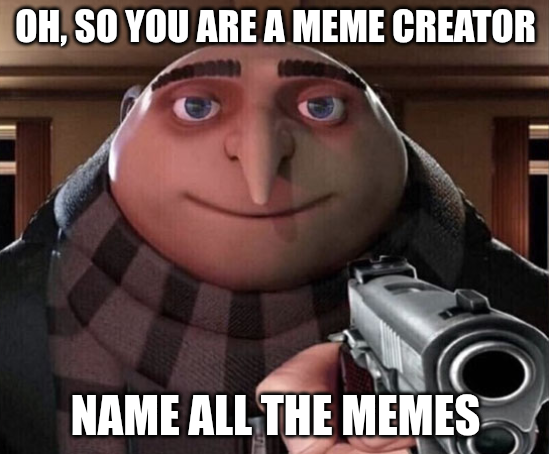
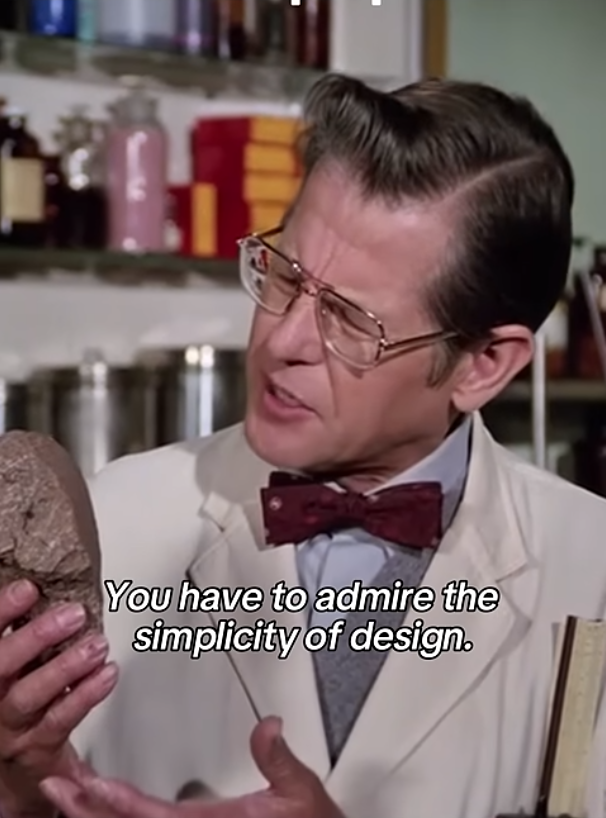
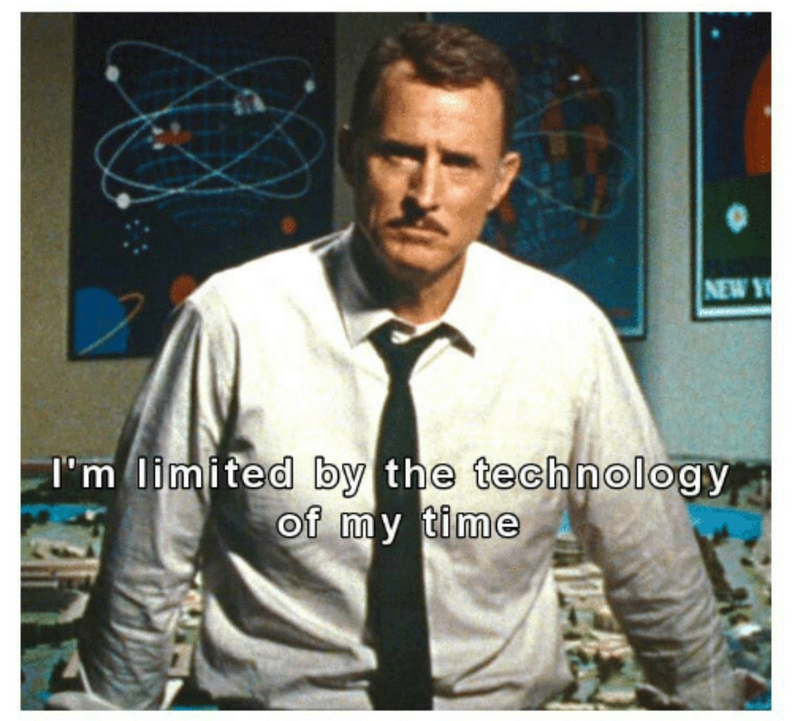

Did you ever find yourself in a situation a when you needed just the right meme to communicate how you feel but you couldn't find one to express yourself?

Believe me that is a skill issue. Luckily for you, you were granted access to this amaizng tool that does job.

For current version of the project I am using a tournament approach picking memes best suited for specific message and advancing them to the next round untill selection is narrowed down to the declared number.



More advanced version is to include utterances with embedded distance. Which LLM are so far unable to produce reliebly.



## How to Run

### Setup

#### Linux/macOS
```bash
# Create virtual environment and install dependencies
make setup

# Activate the virtual environment
source .venv/bin/activate
```

#### Windows
```cmd
# Create virtual environment and install dependencies
make setup-win

# Activate the virtual environment
.venv\Scripts\activate
```

### Running the Application

#### Linux/macOS
```bash
# Run with a message
python main.py "Can I trust you?"
```

#### Windows
```cmd
# Run with a message
python main.py "Can I trust you?"
```

### Example Output
```
All Right Then, Keep Your Secrets https://i.imgflip.com/4/2lcdkl.jpg
It's a trap https://i.imgflip.com/4/jl52i.jpg
I find your lack of faith disturbing https://i.imgflip.com/4/t88mx.jpg
Trust Nobody, Not Even Yourself https://i.imgflip.com/4/26wvib.jpg
Grumpy Cat Does Not Believe https://i.imgflip.com/4/cend.jpg
```
